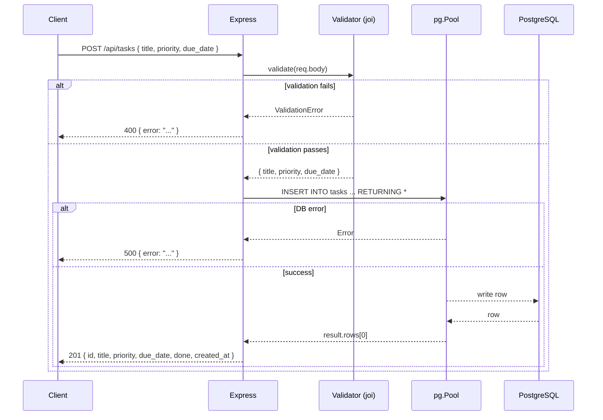

# Design Document: create-task

## Overview

This feature adds a validated `POST /api/tasks` endpoint to the TaskFlow Express backend. The endpoint accepts a task title, optional priority, and optional due date; validates the input using `joi`; inserts a row into PostgreSQL; and returns the created record with HTTP 201. Invalid requests receive a structured 400 response without touching the database.

The implementation lives entirely in `backend/server.js`, following the project convention of keeping all routes in that single file. Tests are added to `backend/tests/tasks.test.js` using Jest + Supertest.

## Architecture

The request lifecycle follows a simple linear pipeline:



No new layers or files are introduced. The existing `pg.Pool` instance is reused.

## Components and Interfaces

### Route Handler: `POST /api/tasks`

Defined inline in `server.js`, consistent with all other routes.

```
POST /api/tasks
Content-Type: application/json

Request body:
  title     string  required
  priority  string  optional  default: "medium"  enum: low | medium | high
  due_date  string  optional  default: null       ISO 8601 date or null

Response 201:
  { id, title, done, priority, due_date, created_at }

Response 400:
  { "error": "title is required" }
  { "error": "priority must be low, medium, or high" }

Response 500:
  { "error": "<pg error message>" }
```

### Validation Schema (joi)

```js
const Joi = require('joi');

const createTaskSchema = Joi.object({
  title:    Joi.string().required().messages({ 'any.required': 'title is required', 'string.empty': 'title is required' }),
  priority: Joi.string().valid('low', 'medium', 'high').default('medium').messages({ 'any.only': 'priority must be low, medium, or high' }),
  due_date: Joi.string().isoDate().allow(null, '').default(null)
});
```

Validation runs before any DB interaction. On failure the handler returns immediately with 400.

### Database Interaction

Uses the existing shared `pool` instance. Single parameterised query:

```sql
INSERT INTO tasks (title, priority, due_date)
VALUES ($1, $2, $3)
RETURNING *
```

`RETURNING *` gives back all columns including the DB-generated `id`, `done` default, and `created_at` timestamp.

## Data Models

### `tasks` table (existing schema)

| Column       | Type        | Notes                        |
|--------------|-------------|------------------------------|
| `id`         | serial PK   | auto-generated               |
| `title`      | text        | not null                     |
| `done`       | boolean     | default false                |
| `priority`   | text        | low / medium / high          |
| `due_date`   | date / null |                              |
| `created_at` | timestamptz | default now()                |

No schema migrations are required — the table already exists.

### Request DTO

```ts
{
  title:    string           // required
  priority: "low"|"medium"|"high"  // optional, default "medium"
  due_date: string | null    // optional ISO date, default null
}
```

### Response DTO

The full row returned by `RETURNING *`:

```ts
{
  id:         number
  title:      string
  done:       boolean
  priority:   string
  due_date:   string | null
  created_at: string
}
```


## Correctness Properties

*A property is a characteristic or behavior that should hold true across all valid executions of a system — essentially, a formal statement about what the system should do. Properties serve as the bridge between human-readable specifications and machine-verifiable correctness guarantees.*

### Property 1: Valid task creation round-trip

*For any* valid request body (non-empty title, valid or omitted priority, present or omitted due_date), submitting `POST /api/tasks` should return HTTP 201 with a response body that contains the submitted `title`, a defined `id`, a defined `created_at`, and the correct `priority` and `due_date` values.

**Validates: Requirements 1.1, 3.1, 3.2**

### Property 2: Default field values

*For any* valid request body that omits `priority` and/or `due_date`, the response body should have `priority === "medium"` when priority is omitted and `due_date === null` when due_date is omitted.

**Validates: Requirements 1.2, 1.3**

### Property 3: Missing title rejected without DB write

*For any* request body that does not include a `title` field (regardless of other fields), the API should return HTTP 400 with `{ "error": "title is required" }` and the total row count in the `tasks` table should remain unchanged.

**Validates: Requirements 2.1, 2.3**

### Property 4: Invalid priority rejected without DB write

*For any* request body that includes a `title` but a `priority` value outside the set `{ "low", "medium", "high" }`, the API should return HTTP 400 with `{ "error": "priority must be low, medium, or high" }` and the total row count in the `tasks` table should remain unchanged.

**Validates: Requirements 2.2, 2.3**

## Error Handling

| Scenario | HTTP Status | Response Body |
|---|---|---|
| Missing `title` | 400 | `{ "error": "title is required" }` |
| Invalid `priority` value | 400 | `{ "error": "priority must be low, medium, or high" }` |
| DB insert failure | 500 | `{ "error": "<pg error message>" }` |
| Success | 201 | Full task record |

Validation runs first via `joi`. If `error` is returned from `schema.validate()`, the handler returns 400 immediately — no DB call is made. DB errors are caught in the `try/catch` block and forwarded as 500.

The `joi` `abortEarly: true` default is kept so only the first validation error is surfaced, matching the exact error message strings specified in the requirements.

## Testing Strategy

### Unit / Integration Tests (Jest + Supertest)

These tests run against the real Express app with a live PostgreSQL connection (same as the existing test suite). They cover the specific examples mandated by Requirement 4 plus the DB-error edge case.

- **Example: valid creation** — POST with `{ title, priority: "medium" }`, assert 201, `id` defined, `title` matches. *(Req 4.1)*
- **Example: missing title** — POST with `{ priority: "high" }`, assert 400, `error === "title is required"`. *(Req 4.2)*
- **Example: invalid priority** — POST with `{ title: "x", priority: "urgent" }`, assert 400, `error === "priority must be low, medium, or high"`. *(Req 4.3)*
- **Example: DB error** — simulate failure (e.g., drop pool connection), assert 500 with `error` key. *(Req 3.3)*

### Property-Based Tests (fast-check)

Property-based tests use [fast-check](https://github.com/dubzzz/fast-check) (available via `npm install --save-dev fast-check`). Each test runs a minimum of 100 iterations.

Each test is tagged with a comment in the format:
`// Feature: create-task, Property <N>: <property text>`

**Property 1 — Valid task creation round-trip**
```
// Feature: create-task, Property 1: valid task creation round-trip
fc.assert(fc.asyncProperty(
  fc.record({ title: fc.string({ minLength: 1 }), priority: fc.constantFrom('low','medium','high') }),
  async ({ title, priority }) => {
    const res = await request(app).post('/api/tasks').send({ title, priority });
    return res.status === 201 && res.body.title === title && res.body.id !== undefined && res.body.created_at !== undefined;
  }
), { numRuns: 100 });
```

**Property 2 — Default field values**
```
// Feature: create-task, Property 2: default field values
fc.assert(fc.asyncProperty(
  fc.string({ minLength: 1 }),
  async (title) => {
    const res = await request(app).post('/api/tasks').send({ title });
    return res.status === 201 && res.body.priority === 'medium' && res.body.due_date === null;
  }
), { numRuns: 100 });
```

**Property 3 — Missing title rejected without DB write**
```
// Feature: create-task, Property 3: missing title rejected without DB write
fc.assert(fc.asyncProperty(
  fc.record({ priority: fc.constantFrom('low','medium','high') }),
  async (body) => {
    const before = (await request(app).get('/api/tasks')).body.length;
    const res = await request(app).post('/api/tasks').send(body);
    const after = (await request(app).get('/api/tasks')).body.length;
    return res.status === 400 && res.body.error === 'title is required' && before === after;
  }
), { numRuns: 100 });
```

**Property 4 — Invalid priority rejected without DB write**
```
// Feature: create-task, Property 4: invalid priority rejected without DB write
fc.assert(fc.asyncProperty(
  fc.tuple(
    fc.string({ minLength: 1 }),
    fc.string({ minLength: 1 }).filter(s => !['low','medium','high'].includes(s))
  ),
  async ([title, priority]) => {
    const before = (await request(app).get('/api/tasks')).body.length;
    const res = await request(app).post('/api/tasks').send({ title, priority });
    const after = (await request(app).get('/api/tasks')).body.length;
    return res.status === 400 && res.body.error === 'priority must be low, medium, or high' && before === after;
  }
), { numRuns: 100 });
```

Both unit and property tests live in `backend/tests/tasks.test.js` and are run with `npm test` (`jest --passWithNoTests --forceExit`).
