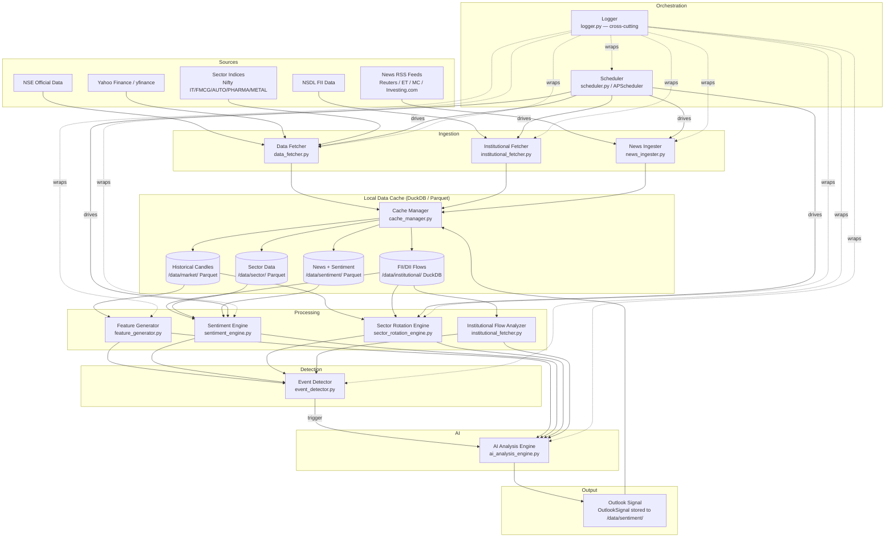
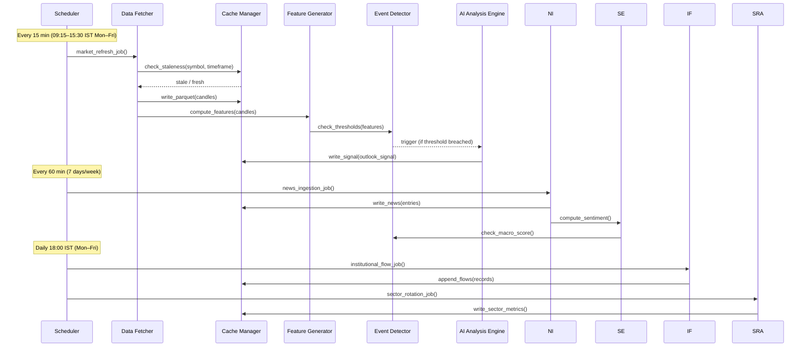

# Design Document: FinIntelligence Market Analysis System

## Overview

FinIntelligence is a standalone Python application that delivers institutional-grade market intelligence for Indian equity markets. It ingests multi-timeframe OHLCV data, FII/DII institutional flows, sector rotation metrics, and financial news from free public sources. A composite sentiment engine and rule-based AI analysis engine synthesise these inputs into structured `Outlook_Signal` outputs. An APScheduler-driven scheduler orchestrates all periodic jobs, and a local Parquet/DuckDB cache eliminates redundant downloads.

The system is entirely self-contained: no external paid APIs, no cloud dependencies, no user-facing web server. It runs as a background process and writes all outputs to local files under `/data/`.

### Design Goals

- **Correctness over speed**: every signal must be reproducible from cached data
- **Resilience**: any single data source failure must not halt the pipeline
- **Observability**: every component logs structured entries; threshold alerts surface systemic failures
- **Minimal footprint**: free public data sources only; local cache avoids re-download

---

## Architecture

### High-Level Pipeline



### Scheduler-Driven Job Flow



### News Flow (Corrected)

News does NOT flow directly from ingester to sentiment engine. The corrected path is:

```
News_Ingester → Cache_Manager (/data/sentiment/) → Sentiment_Engine
```

The Sentiment Engine reads stored news records from cache when computing the macro event score, ensuring the sentiment computation always works from a consistent snapshot.

### Event Detector → AI Analysis Engine Flow

The Event Detector does NOT route directly to output modules. The corrected path is:

```
Event_Detector → AI_Analysis_Engine → Outlook_Signal → Cache_Manager
```

---

## Components and Interfaces

### `main.py` — Entry Point

Bootstraps the logger, initialises the cache manager, and starts the scheduler. Handles `KeyboardInterrupt` for graceful shutdown.

```python
def main() -> None: ...
```

### `config.py` — Configuration

All symbols, timeframes, thresholds, RSS URLs, and directory paths as module-level constants. No runtime mutation.

```python
SYMBOLS: list[str]           # NIFTY_50, BANKNIFTY, sector indices, midcap, smallcap
TIMEFRAMES: list[str]        # ["1D", "4H", "1H", "15M", "5M"]
STALENESS_THRESHOLDS: dict   # {"5M": 5, "15M": 15, "1H": 60, "4H": 240, "1D": 1440}
RSS_URLS: list[str]
DATA_DIR: str                # base path for /data/
MARKET_DIR: str              # /data/market/
SECTOR_DIR: str              # /data/sector/
INSTITUTIONAL_DIR: str       # /data/institutional/
SENTIMENT_DIR: str           # /data/sentiment/
EVENT_THRESHOLDS: dict       # index_pct=1.0, sector_pct=2.0, fii_std_dev=2.0, macro_score=3
TRADING_HOURS: dict          # start="09:15", end="15:30", tz="Asia/Kolkata"
```

### `logger.py` — Cross-Cutting Logger

Wraps Python's `logging` module. Every component imports and uses this logger. Implements a rolling error counter for CRITICAL threshold alerts.

```python
def get_logger(name: str) -> logging.Logger: ...
def record_error(component: str) -> None: ...   # increments rolling 60-min counter
def check_error_threshold() -> None: ...        # emits CRITICAL if >10 errors in 60 min
```

Configuration:
- `RotatingFileHandler`: max 10 MB, 5 backups, writes ALL levels
- `StreamHandler(sys.stderr)`: WARNING and above only
- CRITICAL alert: emitted when error count in any 60-minute rolling window exceeds 10

### `cache_manager.py` — Cache Read/Write

Single interface for all local I/O. Abstracts Parquet (OHLCV, sector, sentiment) and DuckDB/SQLite (institutional flows).

```python
def is_stale(symbol: str, timeframe: str) -> bool: ...
def read_candles(symbol: str, timeframe: str) -> pd.DataFrame: ...
def write_candles(symbol: str, timeframe: str, df: pd.DataFrame) -> None: ...
def read_institutional_flows() -> pd.DataFrame: ...
def write_institutional_flows(df: pd.DataFrame) -> None: ...
def read_sector_metrics() -> pd.DataFrame: ...
def write_sector_metrics(df: pd.DataFrame) -> None: ...
def read_news(hours: int = 24) -> pd.DataFrame: ...
def write_news(df: pd.DataFrame) -> None: ...
def write_sentiment(result: SentimentResult) -> None: ...
def write_signal(signal: OutlookSignal) -> None: ...
def read_latest_signal() -> OutlookSignal | None: ...
```

Parquet path convention: `{DATA_DIR}/market/{symbol}/{timeframe}.parquet`

### `data_fetcher.py` — OHLCV Fetcher

Downloads OHLCV data from Yahoo Finance (primary) with Stooq fallback. Checks cache staleness before downloading.

```python
def fetch_symbol(symbol: str, timeframe: str) -> pd.DataFrame: ...
def fetch_all() -> None: ...
def _fetch_yfinance(symbol: str, timeframe: str) -> pd.DataFrame: ...
def _fetch_stooq(symbol: str, timeframe: str) -> pd.DataFrame: ...
```

Behaviour:
- Checks `cache_manager.is_stale()` before downloading
- On Yahoo Finance empty/malformed response → falls back to Stooq
- On all-source failure → logs and skips (does not raise)
- Minimum 365 candles per symbol/timeframe

### `institutional_fetcher.py` — FII/DII Fetcher

Downloads daily FII/DII gross buy, gross sell, and net values from NSE/NSDL public endpoints.

```python
def fetch_institutional_flows() -> pd.DataFrame: ...
def _parse_flow_record(raw: dict) -> InstitutionalFlow | None: ...
```

Behaviour:
- Rejects records where gross buy or gross sell is non-numeric or negative
- Appends only new trading dates not already in cache
- On endpoint failure → logs and returns cached data

### `news_ingester.py` — RSS Feed Parser

Fetches and parses RSS feeds using `feedparser`. Deduplicates by headline within 24-hour window.

```python
def ingest_all_feeds() -> pd.DataFrame: ...
def _parse_feed(url: str) -> list[dict]: ...
def _deduplicate(entries: list[dict]) -> list[dict]: ...
```

Behaviour:
- Missing publication timestamp → uses ingestion timestamp
- Unreachable/malformed feed → logs and continues to next URL
- Stores to `/data/sentiment/` via Cache_Manager

### `feature_generator.py` — OHLCV Feature Extraction

Computes SMA50, SMA200, volatility, and price-relative-to-MA signals from cached candle data.

```python
def compute_features(symbol: str, timeframe: str) -> dict: ...
def compute_sma(series: pd.Series, period: int) -> pd.Series: ...
def compute_volatility(series: pd.Series, window: int = 20) -> float: ...
def price_vs_sma(close: float, sma: float) -> str: ...  # "above" | "below"
```

### `sector_rotation_engine.py` — Sector Rotation Analyzer

Computes 20-day return, relative strength vs NIFTY_50, ADX (14-period, via `pandas-ta`), and sector ranking.

```python
def compute_sector_metrics() -> pd.DataFrame: ...
def compute_relative_strength(sector_df: pd.DataFrame, nifty_df: pd.DataFrame) -> float: ...
def compute_adx(df: pd.DataFrame, period: int = 14) -> float: ...
def rank_sectors(metrics: pd.DataFrame) -> pd.DataFrame: ...
```

Behaviour:
- Reads 1D candles from cache for all 5 sector indices + NIFTY_50
- Incorporates latest FII/DII net flows from institutional cache
- Ranks all 5 sectors by `relative_strength` descending
- Writes results to `/data/sector/` via Cache_Manager

### `sentiment_engine.py` — Composite Sentiment Scorer

Aggregates four signals into a composite score in `[-1.0, 1.0]`.

```python
def compute_sentiment() -> SentimentResult: ...
def _index_momentum(nifty_df: pd.DataFrame) -> float: ...
def _sector_performance(sector_dfs: dict) -> float: ...
def _institutional_signal(flows_df: pd.DataFrame) -> float: ...
def _macro_score(news_df: pd.DataFrame) -> int: ...
def _composite(signals: dict) -> float: ...
def _classify(score: float) -> str: ...  # "Bullish" | "Neutral" | "Bearish"
```

Signal weights (implementation detail, tunable via config):
- Index momentum: 30%
- Sector performance: 25%
- Institutional flow (normalised): 30%
- Macro event score (normalised): 15%

Score clamped to `[-1.0, 1.0]` after weighted sum.

### `event_detector.py` — Threshold Monitor and AI Trigger

Monitors computed metrics against configured thresholds. Records `TriggerEvent` before invoking AI engine. Implements idempotency guard: same market state cannot trigger duplicate AI runs within the same 15-minute window.

```python
def check_and_trigger(features: dict, sentiment: SentimentResult,
                      sector_metrics: pd.DataFrame,
                      flows_df: pd.DataFrame) -> TriggerEvent | None: ...
def _check_index_move(features: dict) -> bool: ...
def _check_sector_move(sector_metrics: pd.DataFrame) -> bool: ...
def _check_fii_spike(flows_df: pd.DataFrame) -> bool: ...
def _check_macro_score(sentiment: SentimentResult) -> bool: ...
def _is_duplicate(window_key: str) -> bool: ...
```

Threshold logic:
| Trigger | Condition |
|---|---|
| Index move | `abs(nifty_1d_chg) > 1.0%` or `abs(banknifty_1d_chg) > 1.0%` |
| Sector move | `abs(sector_1d_chg) > 2.0%` for any sector |
| FII spike | `abs(fii_net) > mean + 2 * std` over 20-day rolling window |
| Macro event | `macro_score >= 3` within hourly news cycle |

Idempotency: a `(window_key, trigger_type)` tuple is stored in memory; duplicate triggers within the same 15-minute window are suppressed.

### `ai_analysis_engine.py` — Outlook Signal Generator

Rule-based engine that synthesises market structure, flows, and sentiment into an `OutlookSignal`. No external LLM dependency — all logic is deterministic and local.

```python
def generate_signal(candles: dict, sector_metrics: pd.DataFrame,
                    sentiment: SentimentResult,
                    flows_df: pd.DataFrame) -> OutlookSignal: ...
def _market_structure(candles: dict) -> dict: ...
def _direction_vote(structure: dict, sentiment: SentimentResult,
                    flows_df: pd.DataFrame) -> str: ...
def _confidence(votes: list[float]) -> float: ...
def _supporting_factors(structure: dict, sector_metrics: pd.DataFrame,
                        sentiment: SentimentResult) -> list[str]: ...
def _rationale(signal: OutlookSignal) -> str: ...
```

Signal generation logic:
1. Derive market structure from 1D and 4H candles: price vs SMA50, price vs SMA200
2. Weighted vote: structure (40%), sentiment classification (35%), FII net direction (25%)
3. Direction = majority vote across weighted signals
4. Confidence = normalised weighted agreement score in `[0.0, 1.0]`
5. Supporting factors include top/bottom ranked sector, SMA position, sentiment classification
6. Rationale = plain-language summary assembled from factors
7. Must complete within 30 seconds (all operations are in-memory pandas; no network calls)

### `scheduler.py` — APScheduler Job Definitions

Defines and registers all four job types with APScheduler `BackgroundScheduler`.

```python
def build_scheduler() -> BackgroundScheduler: ...
def market_refresh_job() -> None: ...       # every 15 min, 09:15–15:30 IST Mon–Fri
def news_ingestion_job() -> None: ...       # every 60 min, 7 days/week
def institutional_flow_job() -> None: ...   # daily 18:00 IST Mon–Fri
def sector_sentiment_job() -> None: ...     # after institutional_flow_job
```

APScheduler configuration:
- `BackgroundScheduler(timezone="Asia/Kolkata")`
- Market refresh: `CronTrigger(day_of_week="mon-fri", hour="9-15", minute="*/15", start_date with 09:15 guard)`
- News ingestion: `IntervalTrigger(hours=1)`
- Institutional flow: `CronTrigger(day_of_week="mon-fri", hour=18, minute=0)`
- On job exception: log full traceback, reschedule at next regular interval

---

## Data Models

All models are Python dataclasses. Serialisation to/from Parquet uses `pyarrow`.

```python
from dataclasses import dataclass, field
from datetime import datetime

@dataclass
class Candle:
    symbol: str
    timeframe: str          # "1D" | "4H" | "1H" | "15M" | "5M"
    timestamp: datetime     # UTC
    open: float
    high: float
    low: float
    close: float
    volume: float

@dataclass
class InstitutionalFlow:
    date: datetime          # trading date, UTC midnight
    fii_buy: float          # gross buy (crores)
    fii_sell: float         # gross sell (crores)
    fii_net: float          # net = buy - sell
    dii_buy: float
    dii_sell: float
    dii_net: float

@dataclass
class SectorMetrics:
    symbol: str             # e.g. "^CNXIT"
    date: datetime
    return_20d: float       # 20-day price return as decimal
    relative_strength: float  # sector_return_20d / nifty_return_20d
    adx: float              # ADX(14) value
    rank: int               # 1 = strongest, 5 = weakest

@dataclass
class SentimentResult:
    timestamp: datetime     # UTC
    index_momentum: float   # normalised [-1, 1]
    sector_perf: float      # normalised [-1, 1]
    institutional_signal: float  # z-score normalised, clamped [-1, 1]
    macro_score: int        # raw count of macro keyword hits
    composite_score: float  # weighted sum, clamped [-1.0, 1.0]
    classification: str     # "Bullish" | "Neutral" | "Bearish"

@dataclass
class OutlookSignal:
    timestamp: datetime     # UTC
    direction: str          # "Bullish" | "Bearish" | "Neutral"
    confidence: float       # [0.0, 1.0]
    supporting_factors: list[str] = field(default_factory=list)
    rationale: str = ""

@dataclass
class TriggerEvent:
    timestamp: datetime     # UTC
    trigger_type: str       # "index_move" | "sector_move" | "fii_spike" | "macro_event"
    triggering_value: float
    threshold_value: float
```

### Storage Layout

```
/data/
├── market/
│   └── {SYMBOL}/
│       └── {TIMEFRAME}.parquet      # Candle records, appended
├── institutional/
│   └── flows.db                     # DuckDB: InstitutionalFlow table
├── sector/
│   └── sector_metrics.parquet       # SectorMetrics, date-partitioned
└── sentiment/
    ├── news.parquet                  # raw news entries
    ├── sentiment.parquet             # SentimentResult history
    ├── signals.parquet               # OutlookSignal history
    └── trigger_events.parquet        # TriggerEvent log
```

---

## Correctness Properties

*A property is a characteristic or behavior that should hold true across all valid executions of a system — essentially, a formal statement about what the system should do. Properties serve as the bridge between human-readable specifications and machine-verifiable correctness guarantees.*

### Property 1: Cache Round-Trip

*For any* valid data object (Candle DataFrame, InstitutionalFlow record, SectorMetrics record, SentimentResult, OutlookSignal), writing it to the cache and then reading it back should produce an equivalent object with no data loss or type coercion.

**Validates: Requirements 2.1, 2.2, 2.3, 2.4**

---

### Property 2: Cache Staleness Bounds

*For any* (symbol, timeframe) pair and any cache write timestamp `t`, `is_stale()` should return `False` when the current time is within `t + staleness_threshold[timeframe]` minutes, and `True` when the current time exceeds that window. The staleness thresholds are: 5M→5min, 15M→15min, 1H→60min, 4H→240min, 1D→1440min.

**Validates: Requirements 2.5, 2.6**

---

### Property 3: FII/DII Flow Validation

*For any* raw institutional flow record where `fii_buy`, `fii_sell`, `dii_buy`, or `dii_sell` is non-numeric or negative, the parser should reject the record and return `None` — the rejected record must never appear in the institutional flow store.

**Validates: Requirements 3.5**

---

### Property 4: Sector Ranking Completeness and Order

*For any* computed set of sector metrics, the ranked output must contain exactly all 5 configured sector indices (no duplicates, no omissions), assigned ranks 1 through 5, ordered strictly by `relative_strength` descending (rank 1 = highest relative strength).

**Validates: Requirements 4.5**

---

### Property 5: Sentiment Score Bounds

*For any* combination of index momentum, sector performance, institutional flow signal, and macro event score values within their valid input ranges, the composite sentiment score produced by the Sentiment Engine must always be in the closed interval `[-1.0, 1.0]`.

**Validates: Requirements 6.5**

---

### Property 6: Sentiment Classification Correctness

*For any* composite score `s`, the classification must be exactly: `"Bearish"` if `s < -0.3`, `"Neutral"` if `-0.3 ≤ s ≤ 0.3`, and `"Bullish"` if `s > 0.3`. No score should produce an unclassified or invalid classification string.

**Validates: Requirements 6.6**

---

### Property 7: Event Threshold Trigger

*For any* market state where at least one of the following conditions holds — `abs(nifty_1d_chg) > 1.0%`, `abs(banknifty_1d_chg) > 1.0%`, `abs(any_sector_1d_chg) > 2.0%`, `abs(fii_net) > mean + 2*std`, or `macro_score >= 3` — the Event Detector must return a non-None `TriggerEvent` with the correct `trigger_type`, `triggering_value`, and `threshold_value` populated.

**Validates: Requirements 7.2, 7.3, 7.4, 7.5, 7.6**

---

### Property 8: Event Trigger Idempotency

*For any* market state that qualifies as a trigger event, calling `check_and_trigger()` multiple times with the same market state within the same 15-minute window key must produce a trigger on the first call and `None` on all subsequent calls — the AI Analysis Engine must not be invoked more than once per (window_key, trigger_type) pair.

**Validates: Requirements 7.2, 7.3, 7.4, 7.5**

---

### Property 9: OutlookSignal Completeness

*For any* valid combination of input data (candles dict, sector_metrics DataFrame, SentimentResult, flows DataFrame), the AI Analysis Engine must produce an `OutlookSignal` where: `direction` is one of `{"Bullish", "Bearish", "Neutral"}`, `confidence` is in `[0.0, 1.0]`, `supporting_factors` is a non-empty list of strings, and `rationale` is a non-empty string.

**Validates: Requirements 8.2**

---

### Property 10: Top and Bottom Sector in Supporting Factors

*For any* sector ranking output, the `supporting_factors` list of the generated `OutlookSignal` must contain at least one string referencing the rank-1 sector symbol and at least one string referencing the rank-5 sector symbol.

**Validates: Requirements 8.5**

---

### Property 11: Scheduler Timezone Correctness

*For any* scheduled job registered with the APScheduler instance, the job's `next_run_time` must be expressed in the `Asia/Kolkata` timezone (UTC+5:30). No job should have a `next_run_time` in UTC or any other timezone.

**Validates: Requirements 9.6**

---

### Property 12: Error Threshold CRITICAL Alert

*For any* sequence of more than 10 error log entries recorded within any 60-minute rolling window, the Logger must emit exactly one CRITICAL-level log entry containing the error count and the window start time. Sequences of 10 or fewer errors within the window must not produce a CRITICAL alert.

**Validates: Requirements 10.5**

---

### Property 13: Log Entry Field Completeness

*For any* loggable event (API call, data download, AI inference run, or error), the structured log entry must contain all required fields for that event type: API calls require (timestamp, URL, method, status_code, latency_ms); downloads require (timestamp, symbol, timeframe, candle_count, cache_status); inference runs require (timestamp, trigger_type, input_summary, direction, confidence, duration_ms); errors require (timestamp, component, error_type, message, stack_trace).

**Validates: Requirements 10.1, 10.2, 10.3, 10.4**

---

### Property 14: WARNING-Level Logs Reach stderr

*For any* log entry emitted at `WARNING`, `ERROR`, or `CRITICAL` level, that entry must appear on `sys.stderr` in addition to the rotating file. Log entries at `DEBUG` or `INFO` level must not appear on `sys.stderr`.

**Validates: Requirements 10.7**

---

## Error Handling

### Failure Modes and Responses

| Component | Failure Mode | Response |
|---|---|---|
| Data Fetcher | Yahoo Finance empty/malformed | Fallback to Stooq |
| Data Fetcher | All sources fail for symbol/timeframe | Log + skip; do not halt fetch cycle |
| Cache Manager | Parquet write fails (filesystem error) | Log path + exception; return in-memory data to caller |
| Institutional Fetcher | NSE/NSDL endpoint unreachable | Log URL + status; return last cached flows |
| News Ingester | Feed URL unreachable or malformed | Log URL + error; continue to next feed |
| Scheduler | Job raises unhandled exception | Log job name + full traceback; reschedule at next interval |
| AI Analysis Engine | Input data missing or malformed | Log input summary + error; return None (no signal stored) |

### Error Propagation Rules

1. No component may raise an unhandled exception that propagates to the scheduler job runner — all exceptions must be caught at the component boundary and logged.
2. Cache read failures return an empty DataFrame (not None) so downstream consumers can check `df.empty` without null checks.
3. The Logger itself must never raise — if the rotating file handler fails, it falls back to stderr only.

### Resilience Patterns

- **Graceful degradation**: if institutional flows are unavailable, the Sentiment Engine uses the last cached value with a staleness flag in the log.
- **Partial pipeline**: if the Feature Generator fails for one symbol, the Event Detector skips that symbol's threshold check for that cycle.
- **No cascading failures**: each scheduler job is independent; a failure in `market_refresh_job` does not prevent `news_ingestion_job` from running.

---

## Testing Strategy

### Dual Testing Approach

Both unit tests and property-based tests are required. They are complementary:

- **Unit tests** verify specific examples, integration points, and error conditions
- **Property-based tests** verify universal properties across randomly generated inputs

### Property-Based Testing

**Library**: `hypothesis` (Python) — the standard PBT library for Python with `@given` decorator and built-in strategies.

**Configuration**: Each property test must run a minimum of 100 examples (`settings(max_examples=100)`).

**Tag format**: Each property test must include a comment referencing the design property:
```
# Feature: finintelligence-market-analysis, Property {N}: {property_text}
```

**Property test mapping** (one test per property):

| Property | Test Description | Key Strategy |
|---|---|---|
| P1: Cache Round-Trip | Generate random DataFrames, write + read, assert equality | `st.data_frames()` with typed columns |
| P2: Cache Staleness Bounds | Generate random timestamps relative to threshold windows | `st.timedeltas()` within/outside threshold |
| P3: FII/DII Flow Validation | Generate records with negative/non-numeric fields | `st.floats(max_value=-0.01)`, `st.text()` |
| P4: Sector Ranking | Generate random relative_strength values for 5 sectors | `st.lists(st.floats(), min_size=5, max_size=5)` |
| P5: Sentiment Score Bounds | Generate random signal combinations | `st.floats(min_value=-10, max_value=10)` × 4 |
| P6: Sentiment Classification | Generate scores across full float range | `st.floats(min_value=-1.0, max_value=1.0)` |
| P7: Event Threshold Trigger | Generate market states above/below each threshold | `st.floats()` with threshold-crossing strategies |
| P8: Event Trigger Idempotency | Call check_and_trigger twice with same state in same window | Fixed market state, repeated calls |
| P9: OutlookSignal Completeness | Generate random valid input combinations | Composite strategy over all input types |
| P10: Top/Bottom Sector in Factors | Generate random sector rankings | `st.permutations(SECTOR_SYMBOLS)` |
| P11: Scheduler Timezone | Inspect all registered job next_run_times | Deterministic — check scheduler config |
| P12: Error Threshold Alert | Generate error sequences of varying lengths | `st.integers(min_value=0, max_value=20)` |
| P13: Log Entry Completeness | Generate random loggable events | `st.sampled_from(EVENT_TYPES)` + field strategies |
| P14: WARNING to stderr | Emit log entries at each level, check stderr | `st.sampled_from(logging.getLevelNamesMapping())` |

### Unit Testing

**Framework**: `pytest` with `unittest.mock` for mocking external calls.

Unit tests focus on:
- Specific examples demonstrating correct behaviour (e.g., known OHLCV data → expected SMA values)
- Integration points between components (e.g., Data Fetcher → Cache Manager write path)
- Error condition handling (e.g., all sources fail → no exception raised)
- Edge cases: empty DataFrames, single-row DataFrames, missing timestamps in news entries

**Avoid**: writing unit tests that duplicate what property tests already cover (e.g., do not write 50 unit tests for different score values when P5 covers all float combinations).

### Test File Structure

```
finintelligence/
└── tests/
    ├── test_cache_manager.py          # P1, P2 + unit tests
    ├── test_institutional_fetcher.py  # P3 + unit tests
    ├── test_sector_rotation_engine.py # P4 + unit tests
    ├── test_sentiment_engine.py       # P5, P6 + unit tests
    ├── test_event_detector.py         # P7, P8 + unit tests
    ├── test_ai_analysis_engine.py     # P9, P10 + unit tests
    ├── test_scheduler.py              # P11 + unit tests
    └── test_logger.py                 # P12, P13, P14 + unit tests
```
