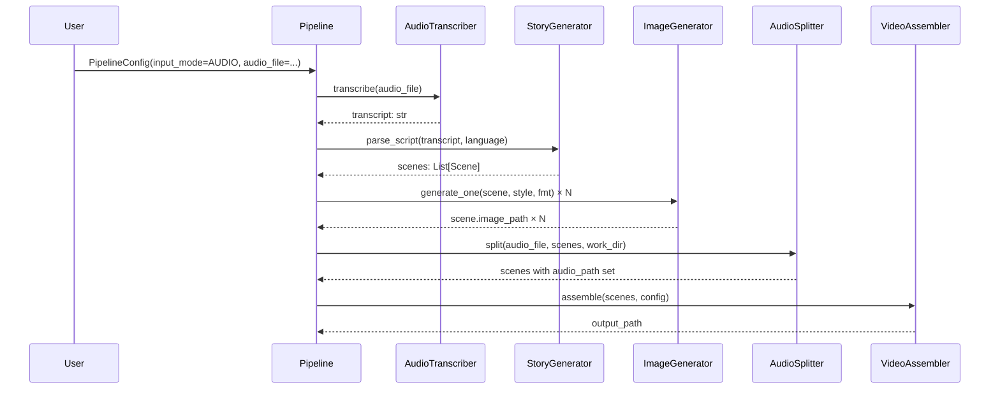
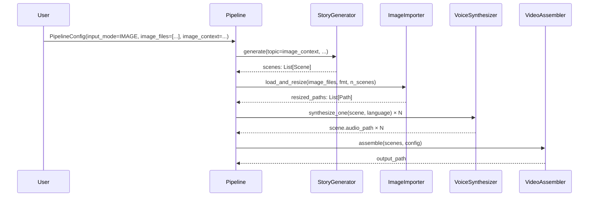

# Design Document — ragai-new-input-modes

## Overview

This feature extends the RAGAI Video Factory with two new input modes that sit alongside the existing "Generate from Topic" (`TOPIC`) and "Use Script File" (`SCRIPT`) modes:

- **Audio Storytelling Input (`AUDIO`)** — the user uploads an audio file; RAGAI transcribes it via the Groq Whisper API, derives scenes from the transcript, and uses the original audio as the narration track (skipping Edge-TTS / gTTS synthesis).
- **Image Upload Input (`IMAGE`)** — the user uploads one or more images and provides optional context text; RAGAI generates a narration from the context, uses the uploaded images as scene visuals (skipping Leonardo AI), and synthesizes voice normally.

Both modes are exposed through the existing GUI (`gui.py`) and CLI (`ragai.py`) and route through the existing five-stage pipeline (`pipeline.py`) with stage-level bypasses controlled by the new `InputMode` enum.

---

## Architecture

The feature follows the existing layered architecture without introducing new layers. The changes are additive:

```
┌─────────────────────────────────────────────────────────────────┐
│  Entry Points                                                   │
│  ragai.py (CLI)          gui.py (tkinter GUI)                   │
└────────────────────────────┬────────────────────────────────────┘
                             │  PipelineConfig (+ input_mode,
                             │  audio_file, image_files,
                             │  image_context)
┌────────────────────────────▼────────────────────────────────────┐
│  pipeline.py — Pipeline.run()                                   │
│                                                                 │
│  Stage 1: Style detection      (all modes)                      │
│  Stage 2: Story / transcript   (AUDIO → AudioTranscriber        │
│                                 IMAGE → StoryGenerator.generate) │
│  Stage 3: Image generation     (IMAGE → ImageImporter           │
│                                 AUDIO/TOPIC/SCRIPT → Leonardo)  │
│  Stage 4: Voice synthesis      (AUDIO → AudioSplitter           │
│                                 others → VoiceSynthesizer)      │
│  Stage 5: Video assembly       (all modes)                      │
└──────┬──────────────┬──────────────────────────────────────────┘
       │              │
┌──────▼──────┐  ┌────▼──────────┐
│ audio_      │  │ image_        │
│ transcriber │  │ importer.py   │
│ .py         │  │               │
│ AudioTrans- │  │ ImageImporter │
│ criber      │  │               │
│ AudioSplit- │  └───────────────┘
│ ter         │
└─────────────┘
```

### Key design decisions

1. **Stage bypasses over subclassing** — The pipeline checks `config.input_mode` at each stage boundary and calls the appropriate component. This keeps `Pipeline.run()` as a single readable method and avoids a complex inheritance hierarchy.
2. **Two new modules** — `audio_transcriber.py` and `image_importer.py` keep the new components isolated and independently testable, matching the existing one-class-per-file convention.
3. **Groq Whisper for transcription** — The project already depends on the Groq API for story generation; reusing the same API key and HTTP client avoids a new dependency.
4. **pydub for audio splitting** — Already used in `voice_synthesizer.py` for segment concatenation; reusing it for splitting keeps the dependency footprint minimal.

---

## Components and Interfaces

### `InputMode` enum (models.py)

```python
class InputMode(str, Enum):
    TOPIC  = "topic"
    SCRIPT = "script"
    AUDIO  = "audio"
    IMAGE  = "image"
```

### `AudioTranscriber` (audio_transcriber.py)

```python
class AudioTranscriber:
    GROQ_WHISPER_URL = "https://api.groq.com/openai/v1/audio/transcriptions"
    SUPPORTED_FORMATS = {".mp3", ".wav", ".m4a", ".ogg", ".flac"}
    MAX_FILE_SIZE_BYTES = 25 * 1024 * 1024  # 25 MB

    def __init__(self, api_key: str) -> None: ...

    def transcribe(self, audio_path: Path) -> str:
        """Submit audio to Groq Whisper; return full transcript string.
        Raises AudioTranscriptionError on API error or unreadable file."""

    def get_word_timestamps(self, audio_path: Path) -> List[WordTimestamp]:
        """Return word-level timing data using verbose_json response format.
        Returns empty list if Whisper does not provide timestamps."""
```

`WordTimestamp` is a small dataclass:
```python
@dataclass
class WordTimestamp:
    word: str
    start: float   # seconds
    end: float     # seconds
```

### `AudioSplitter` (audio_transcriber.py)

```python
class AudioSplitter:
    def split(
        self,
        audio_path: Path,
        scenes: List[Scene],
        work_dir: Path,
    ) -> List[Scene]:
        """Split audio_path into per-scene segments based on scene.duration_seconds.
        Assigns scene.audio_path for each scene. Pads final segment with silence
        if the source audio is shorter than the total scene duration.
        Returns the mutated scenes list."""
```

### `ImageImporter` (image_importer.py)

```python
class ImageImporter:
    SUPPORTED_FORMATS = {".jpg", ".jpeg", ".png", ".webp"}

    def __init__(self, work_dir: Path) -> None: ...

    def load_and_resize(
        self,
        image_paths: List[Path],
        fmt: VideoFormat,
        n_scenes: int,
    ) -> List[Path]:
        """Validate, resize to IMAGE_RESOLUTIONS[fmt], save to work_dir.
        Cycles images if len(image_paths) < n_scenes.
        Truncates if len(image_paths) > n_scenes.
        Raises ImageImportError if any file cannot be opened by PIL."""
```

### `PipelineConfig` additions (models.py)

Three new fields added to the existing dataclass:

```python
@dataclass
class PipelineConfig:
    # ... existing fields ...
    input_mode: InputMode = InputMode.TOPIC
    audio_file: Optional[str] = None          # path string for AUDIO mode
    image_files: List[str] = field(default_factory=list)   # IMAGE mode
    image_context: str = ""                   # IMAGE mode context text
```

### `Pipeline.run()` routing (pipeline.py)

Stage 2 (story/transcript):
- `TOPIC` / `SCRIPT` → existing logic unchanged
- `AUDIO` → `AudioTranscriber.transcribe()` → `StoryGenerator.parse_script()`
- `IMAGE` → `StoryGenerator.generate(topic=image_context or derived_topic)`

Stage 3 (images):
- `TOPIC` / `SCRIPT` / `AUDIO` → `ImageGenerator.generate_one()` (Leonardo AI)
- `IMAGE` → `ImageImporter.load_and_resize()`

Stage 4 (voice):
- `TOPIC` / `SCRIPT` / `IMAGE` → `VoiceSynthesizer.synthesize_one()`
- `AUDIO` → `AudioSplitter.split()`

### GUI additions (gui.py)

Two new radio buttons added to the "Story Source" `LabelFrame`:
- `"Upload Audio Story"` (value `"audio"`)
- `"Upload Images"` (value `"image"`)

`_on_source_change()` extended to show/hide:
- `_audio_frame` — file-picker + selected path label (audio mode)
- `_image_frame` — multi-select file-picker + context text entry (image mode)

### CLI additions (ragai.py)

Two new argument groups:
```
--audio-file PATH
--image-files PATH[,PATH,...]
--image-context TEXT
```

`cli_main()` sets `input_mode` on `PipelineConfig` based on which argument is present.

---

## Data Models

### New exception types (models.py)

```python
class AudioTranscriptionError(RAGAIError):
    """Raised when Groq Whisper transcription fails."""

class ImageImportError(RAGAIError):
    """Raised when an uploaded image cannot be loaded or validated."""
```

### `WordTimestamp` dataclass (audio_transcriber.py)

```python
@dataclass
class WordTimestamp:
    word: str
    start: float   # seconds from start of audio
    end: float     # seconds from start of audio
```

### Updated `PipelineConfig` (models.py)

| Field | Type | Default | Purpose |
|---|---|---|---|
| `input_mode` | `InputMode` | `InputMode.TOPIC` | Controls pipeline routing |
| `audio_file` | `Optional[str]` | `None` | Path to uploaded audio (AUDIO mode) |
| `image_files` | `List[str]` | `[]` | Paths to uploaded images (IMAGE mode) |
| `image_context` | `str` | `""` | Context text for IMAGE mode story generation |

Existing fields (`topic`, `script_file`) remain unchanged; `topic` is empty string and `script_file` is `None` when not applicable.

### Mermaid — data flow for AUDIO mode



### Mermaid — data flow for IMAGE mode




---

## Correctness Properties

*A property is a characteristic or behavior that should hold true across all valid executions of a system — essentially, a formal statement about what the system should do. Properties serve as the bridge between human-readable specifications and machine-verifiable correctness guarantees.*

### Property 1: Audio file extension validation accepts only supported formats

*For any* file path string, the audio extension validator should accept it if and only if its lowercase extension is one of `{.mp3, .wav, .m4a, .ogg, .flac}`, and reject all others.

**Validates: Requirements 1.3, 1.4**

---

### Property 2: Image file extension validation accepts only supported formats

*For any* list of file path strings, the image extension validator should accept the list if and only if every file's lowercase extension is one of `{.jpg, .jpeg, .png, .webp}`, and reject any list containing an unsupported extension.

**Validates: Requirements 4.3, 4.4**

---

### Property 3: Groq Whisper API error codes produce AudioTranscriptionError

*For any* HTTP error status code returned by the Groq Whisper API (4xx or 5xx), `AudioTranscriber.transcribe()` should raise an `AudioTranscriptionError` whose message includes the status code.

**Validates: Requirements 2.3**

---

### Property 4: AudioTranscriber accepts all supported audio formats without format rejection

*For any* file path whose extension is in `Supported_Audio_Formats`, `AudioTranscriber.transcribe()` should not raise an error due to the file format alone (i.e., format validation passes before the API call).

**Validates: Requirements 2.5**

---

### Property 5: Audio splitting produces exactly N segments with audio_path assigned

*For any* audio file and list of N scenes with positive durations, `AudioSplitter.split()` should return a list of exactly N scenes where every `scene.audio_path` is a non-None `Path` pointing to an existing file.

**Validates: Requirements 3.2, 3.3**

---

### Property 6: AUDIO mode pipeline skips VoiceSynthesizer

*For any* `PipelineConfig` with `input_mode=InputMode.AUDIO`, the pipeline should complete without invoking `VoiceSynthesizer.synthesize_one()` on any scene.

**Validates: Requirements 3.1, 7.3**

---

### Property 7: Resized images match target VideoFormat dimensions

*For any* input image file and `VideoFormat`, `ImageImporter.load_and_resize()` should produce output images whose dimensions exactly match `IMAGE_RESOLUTIONS[fmt]`.

**Validates: Requirements 5.3, 5.4**

---

### Property 8: ImageImporter output length always equals n_scenes

*For any* list of uploaded image paths (whether fewer or more than `n_scenes`) and any positive `n_scenes`, `ImageImporter.load_and_resize()` should return a list of exactly `n_scenes` paths, cycling through the inputs if there are fewer, or truncating if there are more.

**Validates: Requirements 5.6, 5.7**

---

### Property 9: IMAGE mode pipeline skips Leonardo AI image generation

*For any* `PipelineConfig` with `input_mode=InputMode.IMAGE`, the pipeline should complete without invoking `ImageGenerator.generate_one()` on any scene.

**Validates: Requirements 5.5, 7.4**

---

### Property 10: New-mode errors are re-raised by the pipeline

*For any* `AudioTranscriptionError` or `ImageImportError` raised by a pipeline component, the pipeline should catch it, log it, append it to the internal errors list, and then re-raise the same exception to the caller.

**Validates: Requirements 8.3, 8.4**

---

### Property 11: Transcript round-trip — parse_script preserves significant words

*For any* non-empty transcript string `T`, calling `StoryGenerator.parse_script(T, language)` should return a non-empty list of scenes whose concatenated narration text contains all words from `T` that are longer than two characters (significant words), with no significant word silently dropped.

**Validates: Requirements 9.2**

---

### Property 12: Transcript is not truncated for files up to 25 MB

*For any* audio file whose size is ≤ 25 MB, `AudioTranscriber.transcribe()` should return a transcript string whose word count is not less than the word count of the actual spoken content (i.e., no truncation occurs due to size limits within the supported range).

**Validates: Requirements 9.3**

---

## Error Handling

### New exception types

Both new exceptions inherit from `RAGAIError` and are defined in `models.py`:

```python
class AudioTranscriptionError(RAGAIError):
    """Raised when Groq Whisper transcription fails."""

class ImageImportError(RAGAIError):
    """Raised when an uploaded image cannot be loaded or validated."""
```

### Error scenarios and responses

| Scenario | Component | Exception | Pipeline action | GUI action |
|---|---|---|---|---|
| Groq Whisper API returns 4xx/5xx | AudioTranscriber | `AudioTranscriptionError` | log + append + re-raise | show error dialog, re-enable Generate |
| Audio file missing or unreadable | AudioTranscriber | `AudioTranscriptionError` | log + append + re-raise | show error dialog, re-enable Generate |
| Image file cannot be opened by PIL | ImageImporter | `ImageImportError` | log + append + re-raise | show error dialog, re-enable Generate |
| Unsupported audio extension (GUI) | GUI validation | — (no pipeline call) | prevented | show inline error message |
| Unsupported image extension (GUI) | GUI validation | — (no pipeline call) | prevented | show inline error message |
| No images selected (GUI) | GUI validation | — (no pipeline call) | prevented | show inline error message |
| `--audio-file` path missing (CLI) | CLI validation | `sys.exit(1)` | prevented | N/A |
| `--image-files` path missing (CLI) | CLI validation | `sys.exit(1)` | prevented | N/A |
| Both AUDIO and IMAGE modes set | Pipeline | `ConfigError` | raise immediately | show error dialog |

### Pipeline error handling pattern

The existing pattern in `pipeline.py` is preserved for new stages:

```python
try:
    # new stage work
    ...
except AudioTranscriptionError as exc:
    self._errors.append(f"Transcription error: {exc}")
    logger.error("Transcription stage failed: %s", exc)
    raise
```

---

## Testing Strategy

### Dual testing approach

Both unit tests and property-based tests are required. They are complementary:
- **Unit tests** cover specific examples, integration wiring, and error conditions.
- **Property tests** verify universal invariants across randomly generated inputs.

### Property-based testing library

**`hypothesis`** (Python) is the chosen PBT library. It integrates naturally with `pytest`, supports custom strategies for generating file paths, image data, and scene lists, and provides shrinking for minimal failing examples.

Install: `pip install hypothesis pytest`

Each property test must run a minimum of **100 iterations** (configured via `@settings(max_examples=100)`).

Each property test must include a comment tag in the format:
`# Feature: ragai-new-input-modes, Property N: <property_text>`

### Unit tests (pytest)

Focus areas:
- `AudioTranscriber.transcribe()` with mocked Groq API responses (success, 4xx, 5xx, network error)
- `AudioTranscriber.get_word_timestamps()` with mocked verbose_json response
- `AudioSplitter.split()` with a real short WAV file — verify segment count and file existence
- `ImageImporter.load_and_resize()` with real PIL images — verify dimensions and file existence
- `ImageImporter.load_and_resize()` with a corrupt file — verify `ImageImportError`
- `Pipeline.run()` with `input_mode=AUDIO` — mock all components, verify `VoiceSynthesizer` not called
- `Pipeline.run()` with `input_mode=IMAGE` — mock all components, verify `ImageGenerator` not called
- `Pipeline.run()` with both AUDIO and IMAGE set — verify `ConfigError` raised
- GUI radio button visibility toggling (using `tkinter` test helpers)
- CLI argument parsing for `--audio-file`, `--image-files`, `--image-context`
- `PipelineConfig` instantiation with all new fields
- Exception hierarchy: `AudioTranscriptionError` and `ImageImportError` are subclasses of `RAGAIError`

### Property tests (hypothesis)

Each property below maps to a design property:

```python
# Feature: ragai-new-input-modes, Property 1: audio extension validation
@given(st.text(min_size=1))
@settings(max_examples=100)
def test_audio_extension_validation(filename): ...

# Feature: ragai-new-input-modes, Property 2: image extension validation
@given(st.lists(st.text(min_size=1), min_size=1))
@settings(max_examples=100)
def test_image_extension_validation(filenames): ...

# Feature: ragai-new-input-modes, Property 3: Groq error codes raise AudioTranscriptionError
@given(st.integers(min_value=400, max_value=599))
@settings(max_examples=100)
def test_groq_error_raises_transcription_error(status_code): ...

# Feature: ragai-new-input-modes, Property 5: audio splitting produces N segments
@given(st.lists(st.floats(min_value=1.0, max_value=10.0), min_size=1, max_size=12))
@settings(max_examples=100)
def test_audio_split_produces_n_segments(durations): ...

# Feature: ragai-new-input-modes, Property 7: resized images match target dimensions
@given(st.sampled_from(list(VideoFormat)), st.integers(1, 200), st.integers(1, 200))
@settings(max_examples=100)
def test_resized_image_dimensions(fmt, w, h): ...

# Feature: ragai-new-input-modes, Property 8: ImageImporter output length equals n_scenes
@given(st.integers(1, 20), st.integers(1, 20))
@settings(max_examples=100)
def test_image_importer_output_length(n_images, n_scenes): ...

# Feature: ragai-new-input-modes, Property 11: transcript round-trip preserves significant words
@given(st.text(min_size=10, alphabet=st.characters(whitelist_categories=("L", "N", "Zs"))))
@settings(max_examples=100)
def test_transcript_round_trip(transcript): ...
```

### Test file locations

```
tests/
  test_audio_transcriber.py   # unit + property tests for AudioTranscriber, AudioSplitter
  test_image_importer.py      # unit + property tests for ImageImporter
  test_pipeline_routing.py    # unit tests for pipeline input_mode routing
  test_gui_input_modes.py     # unit tests for GUI widget visibility
  test_cli_input_modes.py     # unit tests for CLI argument parsing
```
