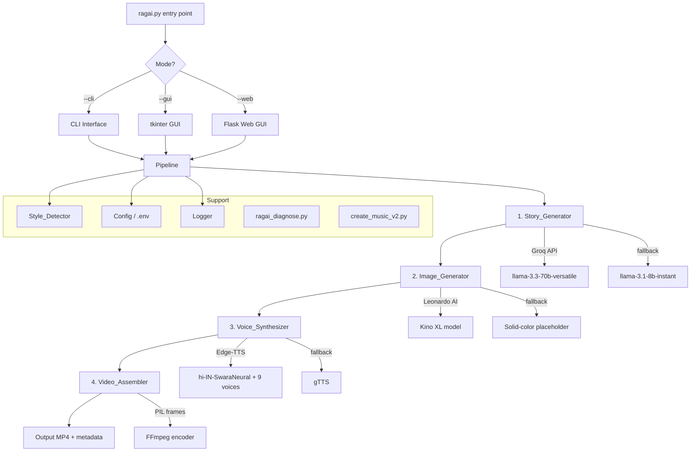
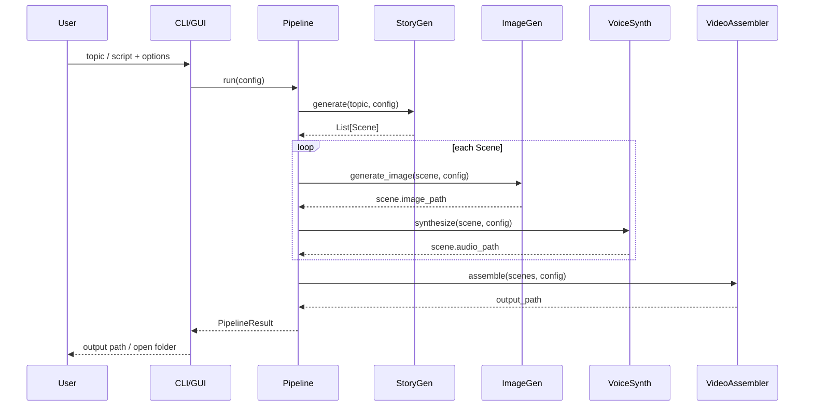
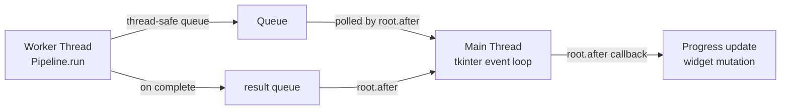

# Design Document: RAGAI Video Factory

## Overview

RAGAI (Reel AI Generator for Automated Intelligence) is a pure-Python desktop application that converts a story topic or user-supplied script into a complete cinematic MP4 video ready for YouTube upload. The system orchestrates five sequential pipeline stages — story generation, image generation, voice synthesis, Ken Burns animation, and video assembly — coordinated by a central `Pipeline` class. Both a CLI and a tkinter GUI expose the same pipeline, ensuring feature parity between interfaces.

The application is Windows-first, lives at `C:\Users\kunal\RAGAI\`, and is launched via a `START_RAGAI.bat` shortcut on the Desktop. All secrets are stored in a `.env` file; no secrets are ever written to logs or stdout.

### Key Design Goals

- Single-file entry point (`ragai.py`) that routes to CLI or GUI mode
- Stateless, stage-isolated pipeline where each stage receives a `PipelineContext` and returns an updated one
- Graceful degradation at every external API boundary (retry → fallback → placeholder)
- Thread-safe GUI that never blocks the tkinter main loop

---

## Architecture



### Component Interaction Flow



---

## Components and Interfaces

### `ragai.py` — Entry Point

```python
def main() -> None:
    """Parse sys.argv; dispatch to cli_main(), gui_main(), or web_main()."""

def cli_main(args: argparse.Namespace) -> int:
    """Run pipeline from CLI args. Returns exit code."""

def gui_main() -> None:
    """Launch tkinter GUI event loop."""

def web_main() -> None:
    """Launch Flask development server."""
```

### `pipeline.py` — Pipeline Orchestrator

```python
@dataclass
class PipelineConfig:
    topic: str
    script_file: Optional[str]
    audience: Audience          # enum: FAMILY | CHILDREN | ADULTS | DEVOTEES
    language: Language          # enum: HI | TA | TE | BN | GU | MR | KN | ML | PA | UR
    style: VisualStyle          # enum or AUTO
    format: VideoFormat         # enum: LANDSCAPE | SHORTS
    character_names: Dict[str, str]
    output_dir: Path
    use_edge_tts: bool
    groq_api_key: str
    leonardo_api_key: str

@dataclass
class PipelineResult:
    output_path: Path
    thumbnail_path: Path
    metadata_txt_path: Path
    scenes: List[Scene]
    elapsed_seconds: float

class Pipeline:
    def __init__(self, config: PipelineConfig, progress_callback: Optional[Callable] = None): ...
    def run(self) -> PipelineResult: ...
    def _update_progress(self, stage: str, scene_num: int, total: int) -> None: ...
```

### `story_generator.py`

```python
class StoryGenerator:
    def __init__(self, api_key: str, model: str = "llama-3.3-70b-versatile"): ...

    def generate(
        self,
        topic: str,
        audience: Audience,
        style: VisualStyle,
        language: Language,
        character_names: Dict[str, str],
    ) -> List[Scene]: ...

    def parse_script(self, script_text: str, language: Language) -> List[Scene]: ...

    def _build_prompt(self, topic: str, audience: Audience, style: VisualStyle, language: Language) -> str: ...
    def _parse_llm_response(self, raw: str) -> List[Scene]: ...
    def _call_groq(self, prompt: str, model: str) -> str: ...
```

### `image_generator.py`

```python
class ImageGenerator:
    MODEL_ID = "aa77f04e-3eec-4034-9c07-d0f619684628"

    def __init__(self, api_key: str, work_dir: Path): ...

    def generate_all(self, scenes: List[Scene], style: VisualStyle, fmt: VideoFormat) -> List[Scene]:
        """Mutates scene.image_path for each scene. Returns updated scenes."""

    def generate_one(self, scene: Scene, style: VisualStyle, fmt: VideoFormat) -> Path: ...
    def _build_prompt(self, scene: Scene, style: VisualStyle) -> str: ...
    def _poll_generation(self, generation_id: str) -> str: ...  # returns image URL
    def _download_image(self, url: str, dest: Path) -> Path: ...
    def _placeholder_image(self, scene: Scene, fmt: VideoFormat) -> Path: ...
    def _estimate_credits(self) -> int: ...
```

### `voice_synthesizer.py`

```python
VOICE_MAP: Dict[Language, str] = {
    Language.HI: "hi-IN-SwaraNeural",
    Language.TA: "ta-IN-PallaviNeural",
    Language.TE: "te-IN-ShrutiNeural",
    Language.BN: "bn-IN-TanishaaNeural",
    Language.GU: "gu-IN-DhwaniNeural",
    Language.MR: "mr-IN-AarohiNeural",
    Language.KN: "kn-IN-SapnaNeural",
    Language.ML: "ml-IN-SobhanaNeural",
    Language.PA: "pa-IN-VaaniNeural",
    Language.UR: "ur-PK-UzmaNeural",
}

class VoiceSynthesizer:
    MAX_SEGMENT_CHARS = 500

    def __init__(self, use_edge_tts: bool, work_dir: Path): ...

    def synthesize_all(self, scenes: List[Scene], language: Language) -> List[Scene]:
        """Mutates scene.audio_path for each scene."""

    def synthesize_one(self, scene: Scene, language: Language) -> Path: ...
    def _edge_tts(self, text: str, voice: str, dest: Path) -> Path: ...
    def _gtts_fallback(self, text: str, lang_code: str, dest: Path) -> Path: ...
    def _split_text(self, text: str) -> List[str]: ...
    def _concat_audio(self, parts: List[Path], dest: Path) -> Path: ...
```

### `video_assembler.py`

```python
class VideoAssembler:
    FPS = 30
    TRANSITION_DURATION = 0.5   # seconds
    MUSIC_FADE_IN = 2.0
    MUSIC_FADE_OUT = 3.0

    def __init__(self, work_dir: Path, music_dir: Path, output_dir: Path): ...

    def assemble(self, scenes: List[Scene], config: PipelineConfig) -> Path:
        """Full assembly: frames → per-scene clips → concat → mix music → encode."""

    def _ken_burns_frames(self, scene: Scene, fmt: VideoFormat) -> List[np.ndarray]: ...
    def _write_scene_clip(self, scene: Scene, frames: List[np.ndarray]) -> Path: ...
    def _concat_clips(self, clip_paths: List[Path], transition: float) -> Path: ...
    def _mix_music(self, video_path: Path, music_path: Path, style: VisualStyle) -> Path: ...
    def _build_ffmpeg_cmd(self, inputs: List[str], filters: str, output: Path) -> List[str]: ...
    def _select_music(self, style: VisualStyle) -> Path: ...
    def _generate_thumbnail(self, scenes: List[Scene], fmt: VideoFormat) -> Path: ...
    def _write_metadata_txt(self, topic: str, language: Language, scenes: List[Scene]) -> Path: ...
```

### `style_detector.py`

```python
class VisualStyle(str, Enum):
    DYNAMIC_EPIC          = "DYNAMIC_EPIC"
    MYSTERY_DARK          = "MYSTERY_DARK"
    SPIRITUAL_DEVOTIONAL  = "SPIRITUAL_DEVOTIONAL"
    PEACEFUL_NATURE       = "PEACEFUL_NATURE"
    ROMANTIC_DRAMA        = "ROMANTIC_DRAMA"
    ADVENTURE_ACTION      = "ADVENTURE_ACTION"
    AUTO                  = "AUTO"

STYLE_PROMPT_MODIFIERS: Dict[VisualStyle, str] = { ... }
STYLE_COLOR_GRADE: Dict[VisualStyle, str] = { ... }   # FFmpeg filter strings
STYLE_MUSIC_MAP: Dict[VisualStyle, str] = { ... }     # music filename

class StyleDetector:
    def detect(self, topic: str) -> VisualStyle: ...
    def _keyword_match(self, topic: str) -> Optional[VisualStyle]: ...
```

### `config.py`

```python
@dataclass
class AppConfig:
    groq_api_key: str
    leonardo_api_key: str
    use_edge_tts: bool = True
    default_language: str = "hi"
    default_format: str = "landscape"
    log_level: str = "INFO"

def load_config(env_path: Path = Path(".env")) -> AppConfig:
    """Load and validate .env. Raises ConfigError if required keys missing."""
```

### `gui.py` — tkinter GUI

```python
class RAGAIApp(tk.Tk):
    def __init__(self, app_config: AppConfig): ...
    def _build_ui(self) -> None: ...
    def _on_generate(self) -> None:
        """Validate inputs, build PipelineConfig, start worker thread."""
    def _start_pipeline_thread(self, pipeline_config: PipelineConfig) -> None: ...
    def _on_progress(self, stage: str, scene: int, total: int) -> None:
        """Called from worker thread via root.after() — updates progress bar."""
    def _on_complete(self, result: PipelineResult) -> None: ...
    def _on_error(self, exc: Exception) -> None: ...
    def _open_output_dir(self) -> None: ...
```

---

## Data Models

```python
from dataclasses import dataclass, field
from pathlib import Path
from typing import Optional
from enum import Enum

class Audience(str, Enum):
    FAMILY    = "family"
    CHILDREN  = "children"
    ADULTS    = "adults"
    DEVOTEES  = "devotees"

class Language(str, Enum):
    HI = "hi"   # Hindi
    TA = "ta"   # Tamil
    TE = "te"   # Telugu
    BN = "bn"   # Bengali
    GU = "gu"   # Gujarati
    MR = "mr"   # Marathi
    KN = "kn"   # Kannada
    ML = "ml"   # Malayalam
    PA = "pa"   # Punjabi
    UR = "ur"   # Urdu

class VideoFormat(str, Enum):
    LANDSCAPE = "landscape"   # 1920x1080
    SHORTS    = "shorts"      # 1080x1920

@dataclass
class Scene:
    number: int
    narration: str                    # text in selected Language
    image_prompt: str                 # English prompt for Leonardo AI
    duration_seconds: float           # target scene duration
    image_path: Optional[Path] = None # set after image generation
    audio_path: Optional[Path] = None # set after voice synthesis
    clip_path: Optional[Path] = None  # set after Ken Burns encoding

@dataclass
class StyleConfig:
    style: VisualStyle
    prompt_modifiers: str             # appended to every image prompt
    color_grade_filter: str           # FFmpeg vf filter string
    music_filename: str               # filename in music/ dir
    color_palette: str                # human-readable descriptor

@dataclass
class PipelineContext:
    """Mutable state passed through pipeline stages."""
    config: PipelineConfig
    scenes: List[Scene] = field(default_factory=list)
    style_config: Optional[StyleConfig] = None
    work_dir: Path = field(default_factory=lambda: Path("tmp") / uuid4().hex)
    errors: List[str] = field(default_factory=list)
```

### Resolution Constants

```python
RESOLUTIONS: Dict[VideoFormat, Tuple[int, int]] = {
    VideoFormat.LANDSCAPE: (1920, 1080),
    VideoFormat.SHORTS:    (1080, 1920),
}

IMAGE_RESOLUTIONS: Dict[VideoFormat, Tuple[int, int]] = {
    VideoFormat.LANDSCAPE: (1792, 1024),
    VideoFormat.SHORTS:    (1024, 1792),
}
```

---

## Ken Burns Animation Algorithm

The Ken Burns effect creates the illusion of camera motion over a still image by interpolating crop-window position and size across the scene duration.

### Algorithm

```
Given:
  image I of size (W_img, H_img)
  output frame size (W_out, H_out)
  duration D seconds at FPS frames/second
  N = D * FPS total frames

1. Compute safe zoom range:
   min_zoom = 1.0   (full image fits output)
   max_zoom = 1.25  (25% zoom-in maximum to avoid pixelation)

2. Randomly select start and end parameters:
   zoom_start ∈ [1.0, 1.15]
   zoom_end   ∈ [zoom_start, min(zoom_start + 0.15, max_zoom)]
   pan_x_start, pan_y_start ∈ [0.0, 1.0]  (normalised anchor)
   pan_x_end,   pan_y_end   ∈ [0.0, 1.0]

3. For frame i in 0..N-1:
   t = i / (N - 1)                          # linear 0→1
   t_ease = t*t*(3 - 2*t)                   # smoothstep easing

   zoom   = lerp(zoom_start, zoom_end, t_ease)
   crop_w = W_img / zoom
   crop_h = H_img / zoom

   # Clamp anchor so crop window stays inside image
   max_x  = W_img - crop_w
   max_y  = H_img - crop_h
   cx     = lerp(pan_x_start, pan_x_end, t_ease) * max_x
   cy     = lerp(pan_y_start, pan_y_end, t_ease) * max_y

   crop_box = (cx, cy, cx + crop_w, cy + crop_h)
   frame    = I.crop(crop_box).resize((W_out, H_out), LANCZOS)

4. Yield frame as numpy array (H_out, W_out, 3) uint8
```

### Transition Frames

Between consecutive scenes, a 0.5-second crossfade is generated by linearly blending the last frame of scene N with the first frame of scene N+1:

```
alpha = i / (TRANSITION_FPS * TRANSITION_DURATION)
blend = (1 - alpha) * last_frame_N + alpha * first_frame_N1
```

---

## FFmpeg Command Construction

### Per-Scene Clip (frames → video + audio)

```python
def _write_scene_clip(self, scene: Scene, frame_dir: Path) -> Path:
    output = self.work_dir / f"clip_{scene.number:03d}.mp4"
    cmd = [
        "ffmpeg", "-y",
        "-framerate", str(self.FPS),
        "-i", str(frame_dir / "frame_%04d.png"),
        "-i", str(scene.audio_path),
        "-c:v", "libx264", "-preset", "fast", "-crf", "18",
        "-c:a", "aac", "-b:a", "192k",
        "-shortest",
        str(output),
    ]
    return output
```

### Concatenation with Crossfade

Uses FFmpeg `xfade` filter to blend consecutive clips:

```python
# For N clips, build xfade chain:
# [0][1]xfade=transition=fade:duration=0.5:offset=<end_of_clip_0>[v01];
# [v01][2]xfade=transition=fade:duration=0.5:offset=<end_of_clips_01>[v012];
# ...
```

### Final Encode with Music and Color Grade

```python
cmd = [
    "ffmpeg", "-y",
    "-i", str(concat_video),
    "-i", str(music_path),
    "-filter_complex",
        f"[0:v]{color_grade_filter}[vout];"
        f"[1:a]volume=0.15,afade=t=in:d=2,afade=t=out:st={fade_out_start}:d=3[amusic];"
        f"[0:a][amusic]amix=inputs=2:duration=first[aout]",
    "-map", "[vout]", "-map", "[aout]",
    "-c:v", "libx264", "-b:v", bitrate,
    "-c:a", "aac", "-b:a", "192k",
    "-metadata", f"title={topic}",
    "-metadata", f"comment=Generated by RAGAI at {timestamp}",
    str(output_path),
]
```

Bitrate values: `"8000k"` for Landscape, `"6000k"` for Shorts.

---

## GUI Architecture (tkinter Threading Model)

tkinter is single-threaded: all widget updates must happen on the main thread. The pipeline runs on a `threading.Thread` worker. Communication uses `root.after()` to marshal callbacks back to the main thread.



### Thread Safety Pattern

```python
class RAGAIApp(tk.Tk):
    def _start_pipeline_thread(self, pipeline_config):
        self._queue = queue.Queue()
        def worker():
            try:
                result = Pipeline(pipeline_config, self._enqueue_progress).run()
                self._queue.put(("done", result))
            except Exception as e:
                self._queue.put(("error", e))
        threading.Thread(target=worker, daemon=True).start()
        self._poll_queue()

    def _enqueue_progress(self, stage, scene, total):
        self._queue.put(("progress", stage, scene, total))

    def _poll_queue(self):
        try:
            while True:
                msg = self._queue.get_nowait()
                if msg[0] == "progress":
                    self._update_progress_bar(msg[1], msg[2], msg[3])
                elif msg[0] == "done":
                    self._on_complete(msg[1])
                    return
                elif msg[0] == "error":
                    self._on_error(msg[1])
                    return
        except queue.Empty:
            pass
        self.after(100, self._poll_queue)
```

---

## Error Handling Strategy

| Stage | Error Condition | Strategy |
|---|---|---|
| Config load | Missing required key | Raise `ConfigError`, print remediation, exit(1) |
| Story generation | Groq 429 rate limit | Retry with `llama-3.1-8b-instant`, notify user |
| Story generation | Other Groq error | Log full response, raise `StoryGenerationError` |
| Image generation | Leonardo non-200 | Exponential backoff × 3, then placeholder image |
| Image generation | Credit warning | Log warning when < 20 credits remain |
| Voice synthesis | Edge-TTS failure | Fall back to gTTS, log fallback event |
| Video assembly | FFmpeg not found | Raise `FFmpegNotFoundError` with install instructions |
| Video assembly | FFmpeg non-zero exit | Log stderr, raise `VideoAssemblyError` |
| GUI | Any pipeline error | Display in status label / messagebox, no crash |
| CLI | Any pipeline error | Print human-readable message, exit(1) |

### Retry Utility

```python
def retry_with_backoff(fn, max_attempts=3, base_delay=2.0):
    for attempt in range(max_attempts):
        try:
            return fn()
        except RetryableError as e:
            if attempt == max_attempts - 1:
                raise
            time.sleep(base_delay * (2 ** attempt))
```

### Secret Sanitisation

The logger filters any string matching `sk-[A-Za-z0-9]+` or `Bearer [A-Za-z0-9]+` before writing to file or stdout, ensuring API keys never appear in logs.

---

## Correctness Properties

*A property is a characteristic or behavior that should hold true across all valid executions of a system — essentially, a formal statement about what the system should do. Properties serve as the bridge between human-readable specifications and machine-verifiable correctness guarantees.*

### Property 1: Story scene count invariant

*For any* valid topic string, the story generator must return a list of scenes whose length is between 5 and 12 (inclusive), and every scene must have a non-empty `narration`, a non-empty `image_prompt`, a positive `duration_seconds`, and a unique `number`.

**Validates: Requirements 1.1, 1.3**

---

### Property 2: LLM prompt contains audience and style

*For any* combination of `Audience` value and `VisualStyle` value, the prompt string produced by `_build_prompt` must contain a substring representation of both the audience and the style.

**Validates: Requirements 1.6**

---

### Property 3: Character name substitution completeness

*For any* story text containing placeholder names and any non-empty substitution mapping, after applying character name substitution no key from the mapping should appear in the resulting text.

**Validates: Requirements 1.7**

---

### Property 4: Language instruction in LLM prompt

*For any* `Language` value, the prompt produced by `_build_prompt` must instruct the LLM to produce narration in that language while keeping image prompts in English.

**Validates: Requirements 1.8, 6.2**

---

### Property 5: Image prompt combines scene prompt and style modifiers

*For any* `Scene` and any `VisualStyle` (excluding AUTO), the image prompt string constructed by `ImageGenerator._build_prompt` must contain both the scene's `image_prompt` field and the style's entry from `STYLE_PROMPT_MODIFIERS`.

**Validates: Requirements 2.2, 3.4**

---

### Property 6: Image request resolution matches format

*For any* `VideoFormat`, the width and height values sent in the Leonardo API request must exactly match the entries in `IMAGE_RESOLUTIONS` for that format (1792×1024 for LANDSCAPE, 1024×1792 for SHORTS).

**Validates: Requirements 2.3**

---

### Property 7: Output files encode scene number

*For any* list of scenes processed by the pipeline, each generated image file and each generated audio file must have a filename that contains the zero-padded scene number, and no two scenes may share the same output filename.

**Validates: Requirements 2.7, 4.4**

---

### Property 8: Every VisualStyle has complete style config entries

*For any* `VisualStyle` member (excluding AUTO), the `STYLE_PROMPT_MODIFIERS`, `STYLE_COLOR_GRADE`, and `STYLE_MUSIC_MAP` dictionaries must each contain a non-empty entry for that style.

**Validates: Requirements 3.3**

---

### Property 9: FFmpeg command contains color grade filter for selected style

*For any* `VisualStyle` (excluding AUTO), the FFmpeg command string assembled by `_build_ffmpeg_cmd` must contain the exact filter string from `STYLE_COLOR_GRADE[style]` in its `-filter_complex` argument.

**Validates: Requirements 3.5**

---

### Property 10: Voice synthesizer uses correct voice for every language

*For any* `Language` value in the supported set, when `VoiceSynthesizer.synthesize_one` is called with `use_edge_tts=True`, the Edge-TTS voice name passed to the TTS engine must equal `VOICE_MAP[language]`.

**Validates: Requirements 4.2, 6.1**

---

### Property 11: Long narration is split into segments ≤ 500 characters

*For any* narration string longer than 500 characters, `VoiceSynthesizer._split_text` must return a list of segments where every segment has length ≤ 500, and concatenating all segments produces the original text (round-trip).

**Validates: Requirements 4.6**

---

### Property 12: Ken Burns frame count matches duration × FPS

*For any* scene with a positive `duration_seconds` value and any image, `_ken_burns_frames` must return exactly `round(duration_seconds * FPS)` frames, each as a numpy array of shape `(H_out, W_out, 3)`.

**Validates: Requirements 5.1**

---

### Property 13: Ken Burns zoom values stay within safe range

*For any* scene image and duration, all zoom values interpolated during Ken Burns frame generation must remain in the range `[1.0, 1.25]`, ensuring no frame exceeds the maximum zoom or falls below full-image coverage.

**Validates: Requirements 5.1**

---

### Property 14: FFmpeg encoding spec correctness

*For any* `VideoFormat` and `VisualStyle`, the final FFmpeg command must contain: `-c:v libx264`, `-c:a aac`, `-b:a 192k`, the correct video bitrate (`8000k` for LANDSCAPE, `6000k` for SHORTS), and the correct output resolution.

**Validates: Requirements 5.4, 5.5, 12.1, 12.2**

---

### Property 15: Output filename contains topic slug and timestamp

*For any* topic string, the output MP4 filename produced by the assembler must contain a URL-safe slug derived from the topic and a UTC timestamp string, and must end with `.mp4`.

**Validates: Requirements 5.6**

---

### Property 16: Crossfade transition duration is 0.5 seconds

*For any* pair of consecutive scene clips, the `xfade` filter entry in the FFmpeg command must specify `duration=0.5`.

**Validates: Requirements 5.8**

---

### Property 17: Config raises error for any missing required key

*For any* `.env` content that omits `GROQ_API_KEY` or `LEONARDO_API_KEY` (or both), `load_config` must raise a `ConfigError` whose message identifies the specific missing key(s).

**Validates: Requirements 9.2, 9.4**

---

### Property 18: Log entries never contain API key patterns

*For any* log entry written during a pipeline run, the serialised log string must not match the pattern `sk-[A-Za-z0-9]+` or `Bearer [A-Za-z0-9]{20,}`.

**Validates: Requirements 9.5**

---

### Property 19: Log entries contain all required fields

*For any* log entry emitted by the RAGAI logger, the entry must contain: a parseable ISO-8601 timestamp, a log level string, a pipeline stage name, and a non-empty message. Scene-level entries must additionally contain a scene number.

**Validates: Requirements 10.2**

---

### Property 20: Music selection matches Visual Style

*For any* `VisualStyle` (excluding AUTO), `VideoAssembler._select_music` must return the path to the music file whose filename matches `STYLE_MUSIC_MAP[style]`, and that file must exist in the `music/` directory.

**Validates: Requirements 11.3**

---

### Property 21: Music fade filters present in FFmpeg command

*For any* assembled video, the FFmpeg `-filter_complex` argument must contain `afade=t=in:d=2` and `afade=t=out` with `d=3`.

**Validates: Requirements 11.5**

---

### Property 22: Metadata .txt contains title, description, and exactly 10 hashtags

*For any* topic string and language, the companion `.txt` file generated by `_write_metadata_txt` must contain a non-empty title line, a non-empty description block, and exactly 10 hashtag strings (strings starting with `#`).

**Validates: Requirements 12.3**

---

### Property 23: MP4 metadata tags present in FFmpeg command

*For any* topic string and timestamp, the FFmpeg command must contain `-metadata title=<topic>` and `-metadata comment=` arguments with non-empty values.

**Validates: Requirements 12.4**

---

### Property 24: Thumbnail is 1280×720 JPEG

*For any* pipeline run, the thumbnail file produced by `_generate_thumbnail` must be a valid JPEG image with width 1280 and height 720.

**Validates: Requirements 12.5**

---

## Error Handling

See the Error Handling Strategy table in the Components section above. Key principles:

1. **Fail fast on config** — missing API keys are caught before any network call is made.
2. **Degrade gracefully on external APIs** — retries with backoff, then fallback (placeholder image, gTTS), so the pipeline always produces output even when individual API calls fail.
3. **Never swallow exceptions silently** — every caught exception is logged with full context before a fallback is attempted.
4. **GUI isolation** — the worker thread catches all exceptions and routes them to the main thread via the queue; the GUI never crashes due to pipeline errors.
5. **Secret sanitisation** — a log filter strips API key patterns before any write.

### Exception Hierarchy

```python
class RAGAIError(Exception): ...
class ConfigError(RAGAIError): ...
class StoryGenerationError(RAGAIError): ...
class ImageGenerationError(RAGAIError): ...
class VoiceSynthesisError(RAGAIError): ...
class VideoAssemblyError(RAGAIError): ...
class FFmpegNotFoundError(VideoAssemblyError): ...
```

---

## Testing Strategy

### Dual Testing Approach

Both unit tests and property-based tests are required. They are complementary:

- **Unit tests** verify specific examples, integration points, and error conditions
- **Property tests** verify universal invariants across randomly generated inputs

### Property-Based Testing Library

Use **Hypothesis** (Python) for all property-based tests.

```bash
pip install hypothesis
```

Each property test must run a minimum of **100 iterations** (Hypothesis default is 100; increase with `@settings(max_examples=200)` for critical properties).

Each property test must be tagged with a comment referencing the design property:

```python
# Feature: ragai-video-factory, Property 1: Story scene count invariant
@given(topic=st.text(min_size=3, max_size=200))
@settings(max_examples=100)
def test_story_scene_count(topic):
    ...
```

### Unit Test Coverage

Focus unit tests on:

- Config loading with valid and invalid `.env` content (Requirements 9.1–9.4)
- CLI argument parsing — all flags accepted, interactive mode triggered (Requirements 7.1–7.2)
- Groq 429 fallback — mock client returns 429, verify second call uses fallback model (Requirement 1.4)
- Edge-TTS → gTTS fallback — mock Edge-TTS to raise, verify gTTS called (Requirement 4.3)
- Leonardo retry — mock API to return non-200 three times, verify placeholder used (Requirements 2.4–2.5)
- FFmpegNotFoundError — mock `shutil.which` to return None (Requirement 5.7)
- Diagnostic script checks — mock each dependency and verify output (Requirements 10.3–10.5)
- GUI thread safety — verify pipeline runs on non-main thread (Requirement 8.5)
- Music library file count — verify exactly 7 `.mp3` files exist (Requirement 11.1)

### Property Test Mapping

| Property | Hypothesis Strategy |
|---|---|
| P1: Scene count invariant | `st.text(min_size=3)` for topic; mock Groq response |
| P2: Prompt contains audience+style | `st.sampled_from(Audience)`, `st.sampled_from(VisualStyle)` |
| P3: Character name substitution | `st.dictionaries(st.text(), st.text())` for name map |
| P4: Language in prompt | `st.sampled_from(Language)` |
| P5: Image prompt combines scene+style | `st.builds(Scene, ...)`, `st.sampled_from(VisualStyle)` |
| P6: Image resolution matches format | `st.sampled_from(VideoFormat)` |
| P7: Output files encode scene number | `st.lists(st.builds(Scene, ...), min_size=1, max_size=12)` |
| P8: Every style has config entries | `st.sampled_from(VisualStyle)` (filter AUTO) |
| P9: FFmpeg contains color grade | `st.sampled_from(VisualStyle)` (filter AUTO) |
| P10: Correct voice per language | `st.sampled_from(Language)` |
| P11: Long narration split ≤ 500 chars | `st.text(min_size=501, max_size=5000)` |
| P12: Frame count = duration × FPS | `st.floats(min_value=1.0, max_value=30.0)` for duration |
| P13: Zoom within safe range | `st.floats(min_value=1.0, max_value=30.0)` for duration |
| P14: FFmpeg encoding spec | `st.sampled_from(VideoFormat)`, `st.sampled_from(VisualStyle)` |
| P15: Output filename slug+timestamp | `st.text(min_size=1, max_size=100)` for topic |
| P16: Crossfade 0.5s | `st.lists(st.builds(Scene, ...), min_size=2)` |
| P17: Config error on missing key | `st.sets(st.sampled_from(["GROQ_API_KEY","LEONARDO_API_KEY"]))` |
| P18: No API keys in logs | `st.text()` for log messages containing injected key patterns |
| P19: Log entry fields | `st.builds(LogRecord, ...)` |
| P20: Music matches style | `st.sampled_from(VisualStyle)` (filter AUTO) |
| P21: Music fade filters | `st.builds(PipelineConfig, ...)` |
| P22: Metadata .txt has 10 hashtags | `st.text(min_size=1)` for topic, `st.sampled_from(Language)` |
| P23: MP4 metadata in FFmpeg cmd | `st.text(min_size=1)` for topic |
| P24: Thumbnail 1280×720 JPEG | `st.builds(Scene, ...)` with valid image_path |

### Test File Structure

```
C:\Users\kunal\RAGAI\
├── tests/
│   ├── test_story_generator.py
│   ├── test_image_generator.py
│   ├── test_voice_synthesizer.py
│   ├── test_video_assembler.py
│   ├── test_style_detector.py
│   ├── test_config.py
│   ├── test_pipeline.py
│   └── test_gui.py
```

Run tests with:

```bash
python -m pytest tests/ -v
```
